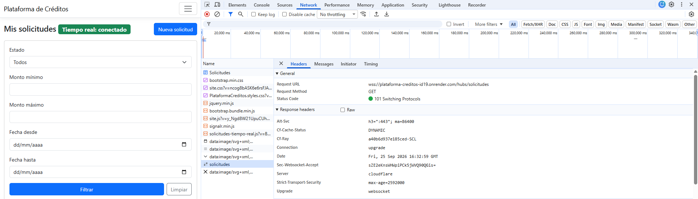
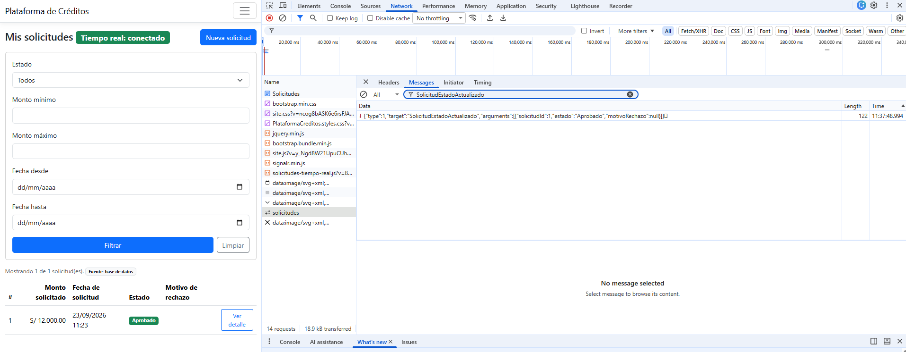
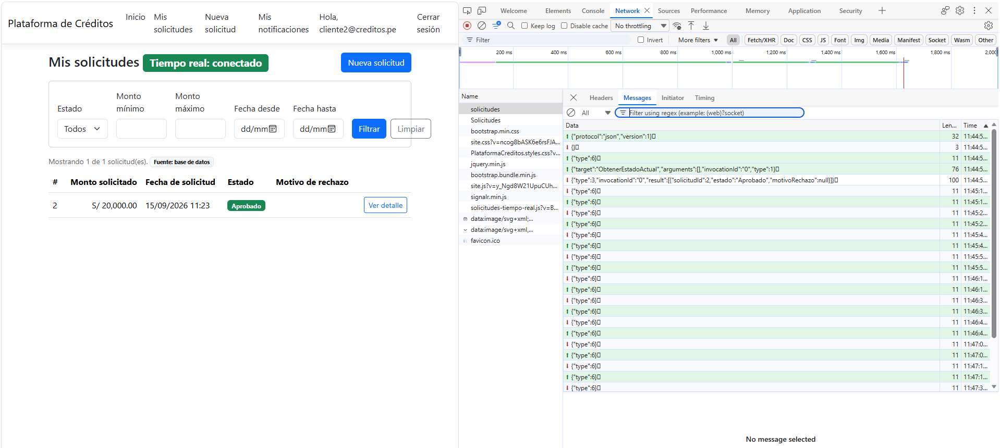
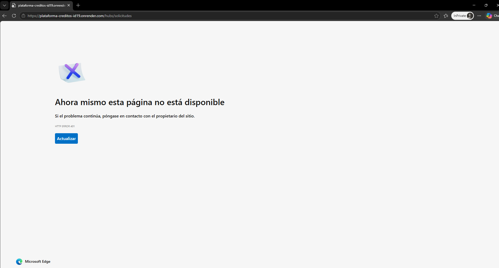
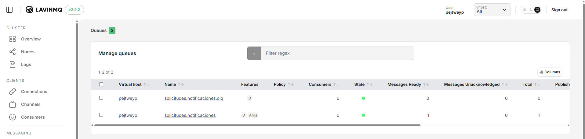
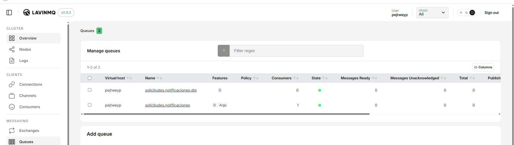
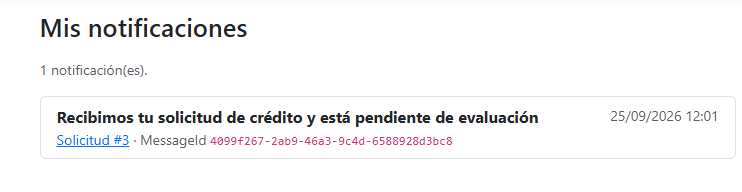
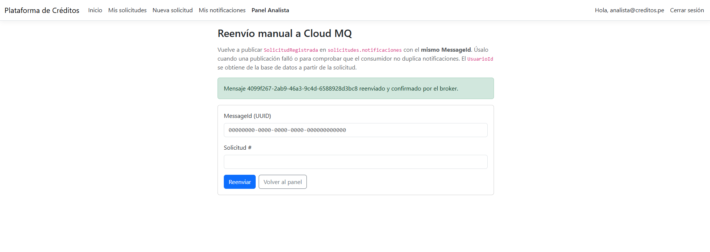
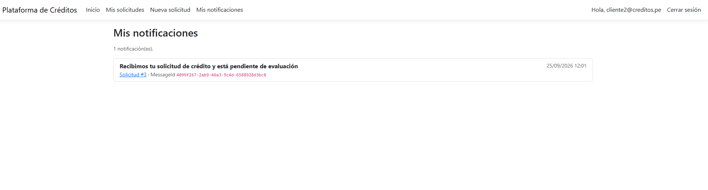

# Plataforma de Créditos

Plataforma web interna para gestionar solicitudes de crédito — Examen Parcial 2026-1.

**URL en Render:** https://plataforma-creditos-id19.onrender.com

> Plan Free: si el servicio estuvo inactivo, la primera carga puede tardar ~50 s mientras despierta.

**Stack:** ASP.NET Core MVC (.NET 10) + Identity · EF Core + SQLite · Razor Views · Redis (sesión y caché) · WebSocket (SignalR) · Cloud MQ (RabbitMQ en CloudAMQP)

## Requisitos locales

- [.NET SDK 10](https://dotnet.microsoft.com/download)
- Herramienta EF Core: `dotnet tool install --global dotnet-ef`
- Redis local (opcional, recomendado): `docker run -d --name pc-redis -p 6379:6379 redis:7-alpine`
- RabbitMQ local (opcional): `docker run -d --name pc-rabbit -p 5672:5672 -p 15672:15672 rabbitmq:4-management` (panel en http://localhost:15672, `guest`/`guest`)

`appsettings.Development.json` apunta a `localhost` para Redis y RabbitMQ (sin credenciales reales).

## Ejecutar en local

```bash
git clone https://github.com/Ccasani-9/Plataforma-de-Creditos.git
cd Plataforma-de-Creditos
dotnet run --project PlataformaCreditos --launch-profile http
# http://localhost:5091
```

Al iniciar, la aplicación **aplica las migraciones automáticamente** y carga los datos iniciales (idempotente).

## Migraciones

```bash
# Crear una migración nueva
dotnet ef migrations add <Nombre> --project PlataformaCreditos -o Data/Migrations
# Aplicar migraciones manualmente (opcional: también se aplican al iniciar)
dotnet ef database update --project PlataformaCreditos
```

| Migración | Contenido |
|---|---|
| `CreateIdentitySchema` | Tablas de ASP.NET Core Identity |
| `Dominio` | `Clientes`, `SolicitudesCredito`, CHECK constraints, índice único filtrado y triggers |

## Modelo de datos y restricciones

- **Cliente**: `Id`, `UsuarioId` (FK única a `AspNetUsers`), `IngresosMensuales`, `Activo`.
- **SolicitudCredito**: `Id`, `ClienteId`, `MontoSolicitado`, `FechaSolicitud`, `Estado {Pendiente, Aprobado, Rechazado}`, `MotivoRechazo`.

| Regla | Dónde se garantiza |
|---|---|
| `IngresosMensuales > 0` | `CHECK CK_Clientes_IngresosMensuales_Positivos` + `[Range]` |
| `MontoSolicitado > 0` | `CHECK CK_SolicitudesCredito_Monto_Positivo` + `[Range]` |
| Una sola solicitud `Pendiente` por cliente | Índice único filtrado `IX_SolicitudesCredito_UnaPendientePorCliente` (`WHERE Estado = 'Pendiente'`) |
| No aprobar si `MontoSolicitado > 5 × IngresosMensuales` | `SolicitudCredito.Aprobar()` (dominio) + triggers SQLite `TR_SolicitudesCredito_Aprobacion_*` |
| Rechazo con motivo | `SolicitudCredito.Rechazar()` + `CHECK CK_SolicitudesCredito_Rechazo_ConMotivo` |

> SQLite no tiene tipo decimal: los montos se guardan como `REAL` para que los filtros por rango y los `CHECK` se evalúen en la base de datos.

## Datos iniciales

Contraseña de todos los usuarios demo: **`Demo123!`**

| Usuario | Rol / Cliente | Ingresos | Solicitudes |
|---|---|---|---|
| `analista@creditos.pe` | Rol **Analista** | — | — |
| `cliente1@creditos.pe` | Cliente activo | 3 000 | 12 000 **Pendiente** |
| `cliente2@creditos.pe` | Cliente activo | 5 000 | 20 000 **Aprobado** |
| `cliente3@creditos.pe` | Cliente **inactivo** | 2 500 | — |

## Funcionalidades

### Mis solicitudes (Pregunta 2)

- `GET /Solicitudes` — listado de las solicitudes del usuario autenticado (`[Authorize]`).
- Filtros: **Estado**, **rango de monto** (mín./máx.) y **rango de fechas** (desde/hasta, hora de Lima, inclusivos).
- `GET /Solicitudes/Detalle/{id}` — detalle completo (monto, fecha, estado, motivo, ingresos, relación monto/ingresos). Si la solicitud es de otro usuario responde **404**.
- Validaciones **server-side** (`FiltroSolicitudesViewModel : IValidatableObject`):
  - montos negativos → error; mínimo > máximo → error;
  - fecha inicio > fecha fin → error.
  - Si los filtros son inválidos no se aplican y se muestran los mensajes en la misma vista.

### Registro de solicitudes (Pregunta 3)

- `GET/POST /Solicitudes/Registrar` — formulario que crea una `SolicitudCredito` en estado **Pendiente**.
- Validaciones **en el servidor** (`SolicitudesService.RegistrarAsync`), con el usuario tomado de la sesión autenticada (nunca del formulario):
  1. Usuario autenticado (`[Authorize]` + `[ValidateAntiForgeryToken]`).
  2. El cliente existe y está **activo**.
  3. No existe otra solicitud **Pendiente** del cliente (además, índice único filtrado en BD para envíos simultáneos).
  4. `MontoSolicitado > 0` y `MontoSolicitado ≤ 10 × IngresosMensuales`.
- Feedback de éxito o error **en la misma vista** (el formulario se limpia tras un registro exitoso).
- `GET/POST /Solicitudes/Perfil` — un usuario recién registrado declara sus ingresos para crear su perfil de cliente.

Casos de prueba rápidos (contraseña `Demo123!`):

| Usuario | Acción | Resultado esperado |
|---|---|---|
| `cliente1` | Registrar cualquier monto | Error: ya tiene una solicitud Pendiente |
| `cliente3` | Registrar cualquier monto | Error: cliente inactivo |
| `cliente2` | Registrar 50 001 | Error: supera 10 × 5 000 |
| `cliente2` | Registrar 50 000 | Éxito, queda Pendiente |

### Sesión y caché con Redis (Pregunta 4)

| Uso | Implementación |
|---|---|
| **Sesión** (Redis-backed) | `AddSession()` sobre `IDistributedCache` de Redis. Al abrir un detalle se guarda la última solicitud visitada (`UltimaSolicitudSesion`) y el layout muestra **"Ver última solicitud S/ {Monto}"** (`UltimaSolicitudViewComponent`). El valor se asocia al usuario para que otro usuario en el mismo navegador no lo vea. |
| **Caché** del listado | `SolicitudesCache`: clave `PlataformaCreditos:solicitudes:usuario:{UsuarioId}`, expiración absoluta **60 s**. Los filtros se aplican sobre la lista cacheada. La vista muestra la fuente: *caché (60 s)* o *base de datos*. |
| **Invalidación** | Al **registrar** una solicitud (`SolicitudesService.RegistrarAsync`) y al **cambiar su estado** (panel Analista). |
| **Data Protection** | Las llaves se guardan en Redis (`PlataformaCreditos:DataProtection-Keys`) para que las cookies de login y sesión sigan siendo válidas tras un reinicio o redespliegue. |

- `Redis:ConnectionString` acepta el formato de StackExchange (`host:puerto,password=...,ssl=True`) o el URI de Redis Cloud (`redis://default:<clave>@host:puerto`, `rediss://` para TLS). Si se pega el comando completo de la consola (`redis-cli -u redis://...`) también se interpreta correctamente.
- Fuera de Development, si no se puede conectar a Redis al iniciar, la app **falla de inmediato con un mensaje claro** (sin mostrar la contraseña) en lugar de quedar bloqueada en cada request.
- En **Development** sin Redis configurado se usa caché en memoria; en **Production** la variable es obligatoria.
- Si Redis falla temporalmente, se registra el error y la consulta se resuelve contra la base de datos.

Comprobar en Redis: `docker exec pc-redis redis-cli --scan` → `PlataformaCreditos:solicitudes:usuario:<id>`, `PlataformaCreditos:<id-sesion>`, `PlataformaCreditos:DataProtection-Keys`.

### Panel de Analista (Pregunta 5)

- Rol **Analista** creado por el seeder; usuario `analista@creditos.pe` / `Demo123!`.
- `GET /Analista` con `[Authorize(Roles = "Analista")]`: lista las solicitudes **Pendientes** con cliente, ingresos, monto y relación monto/ingresos (marca las que exceden 5×).
- `POST /Analista/Aprobar/{id}` y `POST /Analista/Rechazar/{id}` (con antiforgery).
- Validaciones en el servidor (`EvaluacionService` + dominio + BD):
  - no aprobar si el monto excede 5 × ingresos (`SolicitudCredito.Aprobar()` y trigger SQLite);
  - no procesar solicitudes ya aprobadas o rechazadas (regla de dominio + **concurrencia optimista** sobre `Estado`, para que dos analistas no procesen la misma solicitud);
  - motivo obligatorio (máx. 500 caracteres) al rechazar;
  - usuarios sin el rol → **Acceso denegado** (`/Identity/Account/AccessDenied`); anónimos → login.
- Tras cada cambio de estado se **invalida la caché Redis** del cliente propietario.

| Prueba | Resultado |
|---|---|
| `cliente1` entra a `/Analista` | Acceso denegado |
| Analista aprueba 30 000 con ingresos de 5 000 | Error: supera 5× |
| Analista rechaza sin motivo | Error: motivo obligatorio |
| Analista rechaza una solicitud ya rechazada | Error: ya fue procesada |
| Analista aprueba 12 000 con ingresos de 3 000 | Éxito; el listado del cliente refleja el cambio de inmediato (caché invalidada) |

### Notificaciones en tiempo real con WebSocket (Pregunta 6)

> El enunciado pide un *Hub de ASP.NET en `/hubs/solicitudes` protegido con Identity*. Se implementa con **ASP.NET Core SignalR** (el Hub de ASP.NET) restringido al transporte **WebSocket**. Un servicio externo como PieSocket no puede alojar un Hub en el servidor de la app ni validar la cookie de Identity para elegir al destinatario, que son requisitos explícitos.

| Requisito | Implementación |
|---|---|
| Hub en `/hubs/solicitudes` protegido con Identity | `Hubs/SolicitudesHub.cs` con `[Authorize]`; `MapHub(..., Transports = WebSockets)` |
| Transporte WebSocket | Servidor: solo `HttpTransportType.WebSockets`. Cliente: `transport: WebSockets, skipNegotiation: true` |
| Conexión anónima rechazada | `401 Unauthorized` (las rutas `/hubs` no redirigen al login) |
| Evento `SolicitudEstadoActualizado` (`SolicitudId`, `Estado`, `MotivoRechazo`) solo al propietario | `NotificadorSolicitudes` → `Clients.User(Cliente.UsuarioId)`; el destinatario sale de la base de datos, nunca del navegador |
| Orden: BD → caché → evento | `EvaluacionService`: `SaveChanges` → `SolicitudesCache.InvalidarAsync` → `NotificarEstadoAsync` |
| Vistas conectadas | "Mis solicitudes" y "Detalle" (`wwwroot/js/solicitudes-tiempo-real.js`): actualizan el badge y el motivo y muestran un aviso (toast) sin recargar |
| Estado de conexión y reconexión | Badge *Conectando / conectado / Reconectando / Desconectado*; `withAutomaticReconnect` + reintento cada 10 s |
| Recuperar cambios tras desconexión | Al (re)conectar se invoca `ObtenerEstadoActual()` (lee la BD con la identidad del servidor) y se aplican las diferencias |

Las validaciones y la autorización del panel Analista no cambian.

#### Prueba y evidencias

1. Abrir **dos navegadores o ventanas de incógnito independientes**:
   - A: `cliente1@creditos.pe` → *Mis solicitudes* (badge **Tiempo real: conectado**).
   - B: `analista@creditos.pe` → *Panel Analista*.
2. En A: **F12 → Network → filtro "WS"** → recargar → aparece `solicitudes` con estado **101 Switching Protocols** (en Render: `wss://…/hubs/solicitudes`). En la pestaña *Messages* se ven los frames. 📸 `docs/evidencias/p6-websocket-devtools.png`
3. En B: aprobar o rechazar la solicitud Pendiente de cliente1 → en A el estado cambia al instante y aparece el aviso, **sin recargar**. 📸 `p6-evento-recibido.png`
4. Con una tercera ventana como `cliente2@creditos.pe` en *Mis solicitudes*: **no** recibe el evento (sin aviso; en DevTools no llega ningún frame `SolicitudEstadoActualizado`). 📸 `p6-cliente2-no-recibe.png`
5. Conexión anónima (sin cookie) → **401**:
   ```bash
   curl -i -H "Connection: Upgrade" -H "Upgrade: websocket" -H "Sec-WebSocket-Version: 13"         -H "Sec-WebSocket-Key: dGhlIHNhbXBsZSBub25jZQ==" https://<servicio>.onrender.com/hubs/solicitudes
   ```
   📸 `p6-anonimo-401.png`
6. Reconexión: en A, DevTools → Network → **Offline** (badge *Reconectando…*); aprobar/rechazar desde B; volver a **No throttling** → A reconecta, consulta el estado vigente y muestra **"Cambios recuperados"**.

Verificado en local con el cliente oficial `@microsoft/signalr`: cliente1 recibió `{"solicitudId":1,"estado":"Aprobado","motivoRechazo":null}`, cliente2 no recibió nada y el anónimo fue rechazado (`negotiate` y upgrade WebSocket → 401).

#### Evidencias (Render, 2026-09-25)

Capturas tomadas sobre `https://plataforma-creditos-id19.onrender.com` con tres navegadores independientes (cliente1, cliente2 y analista).

**1. Conexión WebSocket segura** — DevTools → Network → Socket: `wss://plataforma-creditos-id19.onrender.com/hubs/solicitudes` con **101 Switching Protocols**; badge *Tiempo real: conectado*.



**2. Evento recibido por el propietario sin recargar** — el analista aprobó la solicitud #1; en la sesión de cliente1 el estado pasó a **Aprobado** y llegó el frame `{"type":1,"target":"SolicitudEstadoActualizado","arguments":[{"solicitudId":1,"estado":"Aprobado","motivoRechazo":null}]}`.



**3. Un segundo cliente no recibe el evento** — cliente2 conectado durante la aprobación: tras el handshake y `ObtenerEstadoActual` (que solo devuelve **su** solicitud #2) únicamente llegan pings `{"type":6}`; ningún `SolicitudEstadoActualizado`.



**4. Conexión anónima rechazada** — ventana privada sin sesión → `/hubs/solicitudes` → **HTTP ERROR 401**.



### Mensajería asíncrona con Cloud MQ (Pregunta 7)

Productor → cola → consumidor que genera la notificación de recepción de la solicitud (RabbitMQ gestionado en **CloudAMQP**).

```
Registrar solicitud -> SaveChanges -> PublicadorSolicitudes --AMQPS + publisher confirm--> [solicitudes.notificaciones]
                                      (solo si se guardó)                                   durable, mensajes persistentes
                                                                                                     |
                                                  ConsumidorNotificaciones (BackgroundService, ACK manual)
                                                     |-- OK / ya procesado -> Notificaciones (SQLite) + ACK
                                                     '-- inválido / falla tras 1 reintento -> [solicitudes.notificaciones.dlq]
```

| Requisito | Implementación |
|---|---|
| Cola durable `solicitudes.notificaciones`, conexión **AMQPS**, credenciales por variables de entorno | `RabbitMqConexion` (`RabbitMq__ConnectionString`, `RabbitMq__QueueName`). Fuera de Development un URI `amqp://` se eleva a `amqps://` (5671). Dead-letter hacia `solicitudes.notificaciones.dlq` |
| Publicar **después** de guardar la solicitud Pendiente; nunca si falla la validación o la persistencia | `SolicitudesService.RegistrarAsync`: la publicación ocurre tras `SaveChangesAsync` |
| Mensaje JSON **persistente** `SolicitudRegistrada` (`MessageId` UUID, `SolicitudId`, `UsuarioId`, `FechaEventoUtc`) | `Messaging/SolicitudRegistrada.cs`; `Persistent = true` (`delivery_mode=2`), `type=SolicitudRegistrada`, `message_id` = MessageId |
| **Confirmación del publicador** | Canal con `publisherConfirmationsEnabled` + tracking y `mandatory: true`: `BasicPublishAsync` espera el ack del broker (timeout 10 s) y lanza `PublishException` si hay nack o return |
| Falla de publicación | Se **conserva la solicitud**, se registra el error (`FALLÓ la publicación … MessageId …`) y se muestra el aviso *"la notificación no pudo encolarse"* con el MessageId para el reenvío |
| Consumidor `BackgroundService` + `RabbitMQ.Client` | `Messaging/ConsumidorNotificaciones.cs` (prefetch 1, `autoAck: false`); se desactiva con `RabbitMq__ConsumerEnabled=false` |
| Guardar `Notificacion` (`Id`, `MessageId`, `SolicitudId`, `UsuarioId`, `Texto`, `FechaProcesamientoUtc`) | `NotificacionesService.ProcesarAsync`; texto: *"Recibimos tu solicitud de crédito y está pendiente de evaluación"*. No aprueba ni rechaza créditos |
| ACK manual solo después de guardar | `BasicAckAsync` tras `SaveChangesAsync` |
| Unicidad de `MessageId` / redelivery sin duplicados | Índice **único** `IX_Notificaciones_MessageId`; si ya existe → ACK sin insertar (log *"ya fue procesado"*) |
| Falla de procesamiento sin reintentos infinitos | No se confirma: `BasicNack` con reencolado **una sola vez** (`Redelivered = false`); si vuelve a fallar → `requeue: false` → DLQ + log |
| Mensaje inválido | `BasicReject(requeue: false)` → DLQ + log `Mensaje INVÁLIDO …` (JSON roto, campos faltantes o solicitud inexistente/ajena) |
| "Mis notificaciones" | `GET /Notificaciones`, filtrada por el usuario autenticado |

#### Reenvío manual con el mismo MessageId

No se implementa un patrón outbox. Cuando una publicación falla, o para reprocesar un mensaje de la DLQ:

- **Opción A (en la app):** como Analista → *Panel Analista* → **Reenvío manual Cloud MQ** (`/Analista/Reenviar`). Ingresar el `MessageId` (aparece en el aviso, en los logs y en *Mis notificaciones*) y el número de solicitud. El `UsuarioId` se toma de la BD y el mensaje se publica con confirmación del broker.
- **Opción B (CloudAMQP):** consola **RabbitMQ Manager** → *Queues* → `solicitudes.notificaciones` → **Publish message**:
  - *Properties:* `message_id=<MessageId>`, `delivery_mode=2`, `content_type=application/json`, `type=SolicitudRegistrada`
  - *Payload:* `{"MessageId":"<MessageId>","SolicitudId":<id>,"UsuarioId":"<id-usuario>","FechaEventoUtc":"2026-01-01T00:00:00Z"}`
- **Desde la DLQ:** en `solicitudes.notificaciones.dlq` usar **Move messages** hacia `solicitudes.notificaciones` (o *Get messages* y volver a publicarlos con la opción B), después de corregir la causa.

En todos los casos el consumidor es idempotente: si el `MessageId` ya se procesó, confirma sin insertar otra notificación.

> Si la cola `solicitudes.notificaciones` se creó antes a mano sin los argumentos de dead-letter, RabbitMQ rechaza la declaración (`PRECONDITION_FAILED`): eliminarla en el RabbitMQ Manager y dejar que la aplicación la cree.

#### Prueba y evidencias (reproducible)

1. En Render → *Environment* → `RabbitMq__ConsumerEnabled=false` → **Save** (se redespliega). El log muestra *"Consumidor … DESACTIVADO"*.
2. Iniciar sesión como un cliente sin solicitud Pendiente (p. ej. `cliente2@creditos.pe`) y **registrar una solicitud**. Aparece *"Notificación encolada… MessageId …"* (copiar el MessageId).
3. CloudAMQP → **RabbitMQ Manager** → *Queues* → `solicitudes.notificaciones`: **Ready = 1**. En *Get messages* se ve el JSON y sus propiedades. 📸 `p7-cola-pendiente.png`
4. Cambiar `RabbitMq__ConsumerEnabled=true` → **Save**. Tras el redespliegue: la cola vuelve a **0** 📸 `p7-cola-vacia.png` y *Mis notificaciones* muestra **una sola** notificación 📸 `p7-mis-notificaciones.png`.
   > En el plan Free, SQLite se re-siembra en cada despliegue (ver P8), así que la solicitud del paso 2 puede no existir tras cambiar la variable. En ese caso el consumidor rechaza el mensaje como inválido (queda en la DLQ con log). Para la demostración en Free, hacer los pasos 1–4 en local (a continuación) o usar un disco persistente.
5. Como Analista → **Reenvío manual Cloud MQ** con el **mismo MessageId** → el log muestra *"ya fue procesado: ACK sin insertar"* y *Mis notificaciones* sigue con **una** notificación. 📸 `p7-reenvio-sin-duplicado.png`

**Misma prueba en local** (RabbitMQ en Docker):

```bash
# 1) Consumidor desactivado (PowerShell: $env:RabbitMq__ConsumerEnabled="false")
RabbitMq__ConsumerEnabled=false dotnet run --project PlataformaCreditos --launch-profile http
#    registrar una solicitud → http://localhost:15672 → Queues → solicitudes.notificaciones: Ready = 1
# 2) Detener la app y volver a iniciarla con el consumidor activo
dotnet run --project PlataformaCreditos --launch-profile http
#    la cola queda en 0 y /Notificaciones muestra 1 notificación
# 3) /Analista/Reenviar con el mismo MessageId → sigue habiendo 1 notificación
```

Resultado verificado en local:

| Paso | Resultado |
|---|---|
| Consumidor desactivado + registro | `ready = 1`, `consumers = 0`; mensaje con `delivery_mode = 2`, `type = SolicitudRegistrada` |
| Consumidor activado | `ready = 0`; *"Notificación guardada y ACK enviado"*; 1 notificación (otro cliente ve 0) |
| Reenvío del mismo MessageId | *"ya fue procesado: ACK sin insertar (sin duplicados)"*; sigue habiendo 1 notificación |
| 3 mensajes inválidos | Rechazados sin reencolar → `solicitudes.notificaciones.dlq` con `ready = 3`, cada uno con log |
| Broker caído al registrar | Solicitud guardada (Pendiente) + aviso *"no pudo encolarse… MessageId …"* + log `FALLÓ la publicación` |
| Reenvío de ese MessageId con el broker activo | Confirmado por el broker; aparece la notificación que faltaba |

#### Evidencias (CloudAMQP, 2026-09-25)

Para que SQLite no se reiniciara entre pasos (plan Free de Render, ver P8), la prueba se ejecutó con la **app en local conectada a la instancia real de CloudAMQP** por AMQPS, con el consumidor de Render desactivado durante la prueba para que no compitiera por la cola. La instancia de CloudAMQP es **LavinMQ**, el broker de CloudAMQP compatible con AMQP 0-9-1; la aplicación usa `RabbitMQ.Client` sin ningún cambio. Extracto de logs: [`docs/evidencias/p7-log-consumidor.txt`](docs/evidencias/p7-log-consumidor.txt).

**1. Consumidor desactivado (`RabbitMq__ConsumerEnabled=false`) y solicitud registrada** — `solicitudes.notificaciones` (**D**urable, con *Args* de dead-letter): **Consumers = 0**, **Messages Ready = 1**.



**2. Consumidor reactivado** — **Consumers = 1**, **Ready = 0**: la cola se vació (la DLQ sigue en 0).



**3. Una sola notificación** en *Mis notificaciones* de cliente2 (Solicitud #3, MessageId `4099f267-2ab9-46a3-9c4d-6588928d3bc8`).



**4. Reenvío del mismo MessageId** (`/Analista/Reenviar`), confirmado por el broker…



…y **no se duplica**: sigue habiendo **1** notificación. El log del consumidor registra `MessageId=4099f267-… ya fue procesado: ACK sin insertar (sin duplicados)`.



### Relación entre las prácticas

WebSocket (P6) comunica al navegador conectado el **resultado de la evaluación**. Cloud MQ (P7) **desacopla el registro** de la solicitud del procesamiento de su notificación de recepción. Cada práctica se demuestra por separado y tiene su propio PR.

## Variables de entorno

| Variable | Valor en Render | Descripción |
|---|---|---|
| `ASPNETCORE_ENVIRONMENT` | `Production` | Entorno |
| `ASPNETCORE_URLS` | `http://0.0.0.0:${PORT}` | Referencia; el **comando de inicio** la sobrescribe con el `PORT` real (ver abajo) |
| `ConnectionStrings__DefaultConnection` | `Data Source=/var/data/plataforma-creditos.db` | Archivo SQLite |
| `Redis__ConnectionString` | `redis://default:<clave>@<host>:<puerto>` | Redis Cloud (sesión, caché, Data Protection) |
| `RabbitMq__ConnectionString` | `amqps://<usuario>:<clave>@<host>/<vhost>` | URI AMQPS de CloudAMQP |
| `RabbitMq__QueueName` | `solicitudes.notificaciones` | Cola durable |
| `RabbitMq__ConsumerEnabled` | `true` | Activa el consumidor (`BackgroundService`) |

> Nunca se suben credenciales al repositorio: en local se usan `appsettings.Development.json` (solo `localhost`) o *user-secrets*; en Render, variables de entorno.

## Despliegue en Render (Pregunta 8)

Archivos: [`Dockerfile`](Dockerfile), [`render.yaml`](render.yaml) (Blueprint) y [`.dockerignore`](.dockerignore).

### Pasos

1. En Render: **New → Blueprint** → elegir este repositorio → Render lee `render.yaml`.
   (Alternativa manual: **New → Web Service** → repositorio → *Language: Docker*, *Instance type: Free*, rama `main`).
2. Completar las variables marcadas como secretas (`Redis__ConnectionString`, `RabbitMq__ConnectionString`). Las demás ya vienen en el Blueprint.
3. **Deploy**. Cada merge a `main` redespliega automáticamente (`autoDeploy: true`).
4. Verificar `https://<servicio>.onrender.com/healthz` → `Healthy`.

### Comando de inicio y PORT

Render inyecta `PORT` en tiempo de ejecución. `${PORT}` **no** se expande dentro del valor de otra variable de entorno, por eso se expande en el **comando de inicio** [`start.sh`](start.sh), que usan tanto el `CMD` del Dockerfile como el `dockerCommand: sh /app/start.sh` del Blueprint:

```sh
export ASPNETCORE_URLS="http://0.0.0.0:${PORT:-10000}"
exec dotnet /app/PlataformaCreditos.dll
```

> Render no interpreta comillas en `dockerCommand` (un `sh -c '...'` falla con *not found*, código 127), por eso la lógica vive en el script.

### HTTPS / WSS detrás del proxy

Render termina TLS en su proxy. `ASPNETCORE_FORWARDEDHEADERS_ENABLED=true` (en el Dockerfile) hace que la app respete `X-Forwarded-Proto`, de modo que las cookies seguras, las redirecciones y el WebSocket (`wss://`) funcionen correctamente.

### Persistencia de SQLite

- Las migraciones se aplican y los datos iniciales se siembran **al arrancar** (idempotente).
- **Plan Free (configuración actual):** el sistema de archivos es efímero, así que en cada despliegue o reinicio SQLite se recrea y se vuelve a sembrar con los usuarios demo. Las sesiones y el login **no** se pierden porque las llaves de Data Protection están en Redis.
- **Para conservar SQLite** entre despliegues y reinicios: plan `starter` + disco persistente montado en `/var/data` (bloque `disk` comentado en `render.yaml`). Como `ConnectionStrings__DefaultConnection` apunta a `/var/data/plataforma-creditos.db`, el archivo queda en el disco y sobrevive a despliegues y reinicios.
- Se ejecuta **una sola instancia** (`numInstances: 1`): SQLite es un archivo local y el consumidor de RabbitMQ corre como `BackgroundService` dentro del mismo proceso.
- En el plan Free el servicio se suspende tras ~15 min sin tráfico; al despertar, el consumidor procesa los mensajes que quedaron en la cola durable.

### Verificación online

Realizada sobre `https://plataforma-creditos-id19.onrender.com`:

| Verificación | Resultado |
|---|---|
| `/healthz` | `Healthy` |
| Login (cliente1, cliente2, analista) | OK |
| Caché Redis | 1.ª visita *base de datos* → 2.ª *caché (60 s)* |
| Sesión Redis | Enlace "Ver última solicitud S/ 20,000.00" en el layout |
| Validaciones | Rechaza monto > 10 × ingresos |
| Registro + publicación en CloudAMQP (AMQPS) | Confirmado por el broker; sin aviso de error |
| Consumo de la cola | 1 notificación en *Mis notificaciones* |
| Panel Analista | Cliente sin rol → *Acceso denegado* |
| WebSocket seguro `wss://…/hubs/solicitudes` | cliente1 recibe `SolicitudEstadoActualizado` al aprobar; cliente2 no recibe nada |
| Conexión anónima al Hub | `401` (upgrade WebSocket y `negotiate`) |

### Probar la imagen en local

```bash
docker build -t plataforma-creditos .
docker run -p 8080:10000 -e PORT=10000 -e Redis__ConnectionString=host.docker.internal:6379 plataforma-creditos
```

## Flujo de trabajo Git

Cada pregunta se desarrolla en su propia rama creada desde `main` actualizado y se integra mediante Pull Request.

| Pregunta | Rama | Pull Request |
|---|---|---|
| 1. Bootstrap + modelo de datos | `feature/bootstrap-dominio` | [#1](https://github.com/Ccasani-9/Plataforma-de-Creditos/pull/1) |
| 2. Catálogo de solicitudes y filtros | `feature/catalogo-solicitudes` | [#2](https://github.com/Ccasani-9/Plataforma-de-Creditos/pull/2) |
| 3. Registro y validaciones de solicitud | `feature/solicitudes` | [#3](https://github.com/Ccasani-9/Plataforma-de-Creditos/pull/3) |
| 4. Sesiones y Redis | `feature/sesion-redis` | [#4](https://github.com/Ccasani-9/Plataforma-de-Creditos/pull/4) |
| 5. Panel de Analista (rol) | `feature/panel-analista` | [#6](https://github.com/Ccasani-9/Plataforma-de-Creditos/pull/6) |
| 6. Notificaciones con WebSocket | `feature/websocket-notificaciones` | [#7](https://github.com/Ccasani-9/Plataforma-de-Creditos/pull/7) |
| 7. Mensajería asíncrona con Cloud MQ | `feature/cloudmq-notificaciones` | [#8](https://github.com/Ccasani-9/Plataforma-de-Creditos/pull/8) |
| 8. Despliegue en Render | `deploy/render` | [#5](https://github.com/Ccasani-9/Plataforma-de-Creditos/pull/5) |
